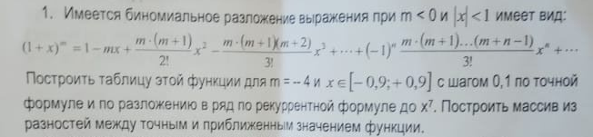
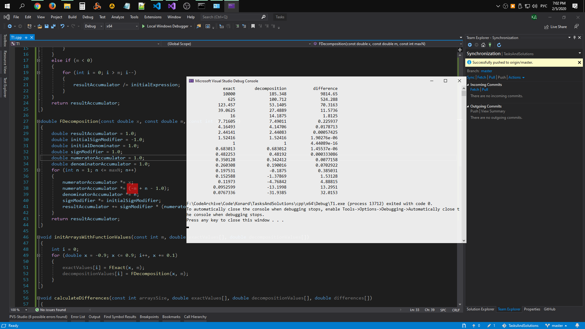
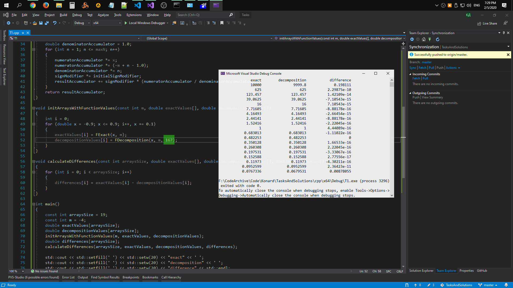
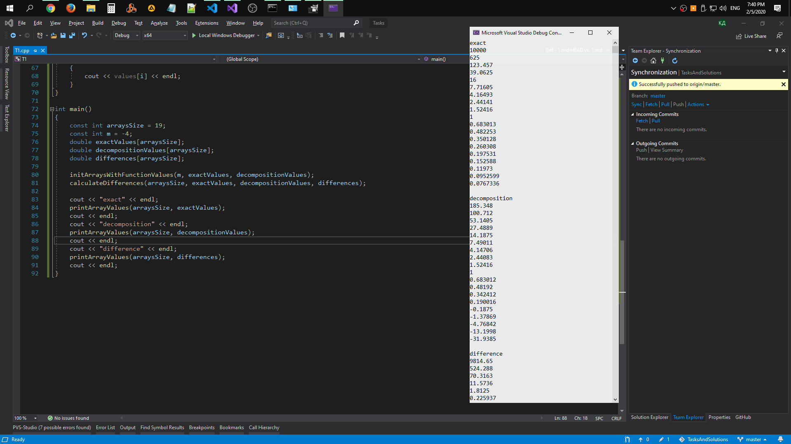

# Task 1

## Description



Имеется биномиальное разложение выражения при m < 0 и |х| < 1 имеет вид:

(1 + x)^m = 1 - m*x + m*x^2*(m + 1)/2! - m*x^3*(m + 1)(m + 2)/3! + ... + (-1)^n * ( m*x^n*(m + 1)...(m + n - 1)/n! ) + ... 

Построить таблицу этой функции для m = -4 и х ∈ \[-0.9; +0,9\] с шагом 0,1 по точной
формуле и по разложению в ряд по рекурсентной формуле до х^7. Построить массив из
разностей между точным и приближенным значением функции.

## Solution

### 1

```C++
#include <iostream>
#include <cmath>
#include <iomanip>
using namespace std;

double FExact(const double x, const int m)
{
    double initialExpression = 1 + x;
    double resultAccumulator = 1;
    if (m > 0)
    {
        for (int i = 0; i < m; i++)
        {
            resultAccumulator *= initialExpression;
        }
    }
    else if (m < 0)
    {
        for (int i = 0; i > m; i--)
        {
            resultAccumulator /= initialExpression;
        }
    }
    return resultAccumulator;
}

double FDecomposition(const double x, const double m, const int maxN = 7)
{
    double resultAccumulator = 1.0;
    double initialSignModifier = -1.0;
    double initialDenominator = 1.0;
    double signModifier = 1.0;
    double numeratorAccumulator = 1.0;
    double denominatorAccumulator = 1.0;
    for (int n = 1; n <= maxN; n++)
    {
        numeratorAccumulator *= x;
        numeratorAccumulator *= (-m + n - 1.0);
        denominatorAccumulator *= n;
        signModifier *= initialSignModifier;
        resultAccumulator += signModifier * (numeratorAccumulator / denominatorAccumulator);
    }
    return resultAccumulator;
}

void initArraysWithFunctionValues(const int m, double exactValues[], double decompositionValues[])
{
    int i = 0;
    for (double x = -0.9; x <= 0.9; i++, x += 0.1)
    {
        exactValues[i] = FExact(x, m);
        decompositionValues[i] = FDecomposition(x, m);
    }
}

void calculateDifferences(const int arraysSize, double exactValues[], double decompositionValues[], double differences[])
{
    for (int i = 0; i < arraysSize; i++)
    {
        differences[i] = exactValues[i] - decompositionValues[i];
    }
}

int main()
{
    const int arraysSize = 19;
    const int m = -4;
    double exactValues[arraysSize];
    double decompositionValues[arraysSize];
    initArraysWithFunctionValues(m, exactValues, decompositionValues);
    double differences[arraysSize];
    calculateDifferences(arraysSize, exactValues, decompositionValues, differences);

    std::cout << std::setfill(' ') << std::setw(20) << "exact" << ' ';
    std::cout << std::setfill(' ') << std::setw(20) << "decomposition" << ' ';
    std::cout << std::setfill(' ') << std::setw(20) << "difference" << std::endl;

    for (int i = 0; i < arraysSize; i++)
    {
        std::cout << std::setfill(' ') << std::setw(20) << exactValues[i] << ' ';
        std::cout << std::setfill(' ') << std::setw(20) << decompositionValues[i] << ' ';
        std::cout << std::setfill(' ') << std::setw(20) << differences[i] << std::endl;
    }
}
```

### 2

```C++
#include <iostream>
#include <cmath>
using namespace std;

double FExact(const double x, const int m)
{
    double initialExpression = 1 + x;
    double resultAccumulator = 1;
    if (m > 0)
    {
        for (int i = 0; i < m; i++)
        {
            resultAccumulator *= initialExpression;
        }
    }
    else if (m < 0)
    {
        for (int i = 0; i > m; i--)
        {
            resultAccumulator /= initialExpression;
        }
    }
    return resultAccumulator;
}

double FDecomposition(const double x, const double m, const int maxN = 7)
{
    double resultAccumulator = 1.0;
    double initialSignModifier = -1.0;
    double initialDenominator = 1.0;
    double signModifier = 1.0;
    double numeratorAccumulator = 1.0;
    double denominatorAccumulator = 1.0;
    for (int n = 1; n <= maxN; n++)
    {
        numeratorAccumulator *= x;
        numeratorAccumulator *= (-m + n - 1.0);
        denominatorAccumulator *= n;
        signModifier *= initialSignModifier;
        resultAccumulator += signModifier * (numeratorAccumulator / denominatorAccumulator);
    }
    return resultAccumulator;
}

void initArraysWithFunctionValues(const int m, double exactValues[], double decompositionValues[])
{
    int i = 0;
    for (double x = -0.9; x <= 0.9; i++, x += 0.1)
    {
        exactValues[i] = FExact(x, m);
        decompositionValues[i] = FDecomposition(x, m);
    }
}

void calculateDifferences(const int arraysSize, double exactValues[], double decompositionValues[], double differences[])
{
    for (int i = 0; i < arraysSize; i++)
    {
        differences[i] = exactValues[i] - decompositionValues[i];
    }
}

void printArrayValues(const int arraysSize, double values[])
{
    for (int i = 0; i < arraysSize; i++)
    {
        cout << values[i] << endl;
    }
}

int main()
{
    const int arraysSize = 19;
    const int m = -4;
    double exactValues[arraysSize];
    double decompositionValues[arraysSize];
    double differences[arraysSize];

    initArraysWithFunctionValues(m, exactValues, decompositionValues);
    calculateDifferences(arraysSize, exactValues, decompositionValues, differences);

    cout << "exact" << endl;
    printArrayValues(arraysSize, exactValues);
    cout << endl;
    cout << "decomposition" << endl;
    printArrayValues(arraysSize, decompositionValues);
    cout << endl;
    cout << "difference" << endl;
    printArrayValues(arraysSize, differences);
    cout << endl;
}
```

## Screenshot

### 1





### 2

