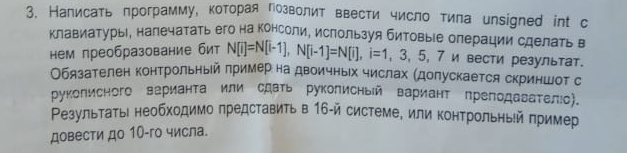

# Task 2

## Description



Написать программу, которая позволит ввести число типа unsigned int с
клавиатуры, напечатать его на консоли, используя битовые операции сделать в
нем преобразование бит N\[i\]=N\[i-1\], N\[i-1\]=N\[i\], i=1, З, 5, 7 и вывести результат.
Обязателен контрольный пример на двоичных числах (допускается скриншот с рукописного
варианта или сдать рукописный вариант преподавателю).
Результаты необходимо представить в 16-й системе, или контрольный пример
довести до 10-го числа.

## Solution

```C++

```