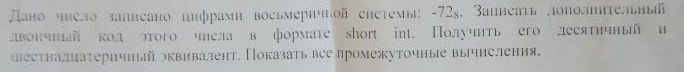

# Task 3

## Description



Дано число записано цифрами восьмеричной системы -72_8. Записать дополнительный
двоичный код этого числа в формате short int. Получить его десятичный и
шестнадцатеричный эквивалент. Показать все промежуточные вычисления.

## Solution

```C++

```