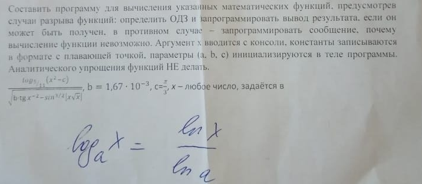

# Task 4

## Description



программы для вычисления мате.мгггически,х предусмотрев
разрыва определить ОДЗ и запрограммировал љ. вывод резылыата. если он
запрограммировать сообщение. почему
может быть в
вимпс„леннс невозможно. Аргумент з. вводится с консоли. кОнстг1нты заласываются
н с плавающей точкой, парамелре,! Ь. с) в теле программы.
упрощения функций НЕ дел:зль.
-3
\* х — любое число. задаётся в


Собазвить программу лля вычисления указанных матемитических функций. предусмотрев
случаи разрыва функций: определить ОДЗ и запрограммировать вывод результата. если он
мажет быть получен. в противном случае - запрограммировать сообщение. почему
вычисление функции невозмодию. Аргуменг * вводится с консоли. константы записываются
в формаие с плавающей точкой. параметры (4. Ь. с) инициализируются в теле программы;
Аналитического упрощения функций НЕ делоль,

ву (ат-ь} . т
= Ь = 1.67. 10-3, с=3, х - любое число, задаётся в г
вт -ми' Ч. хьх: `

ес

## Solution

```C++

```