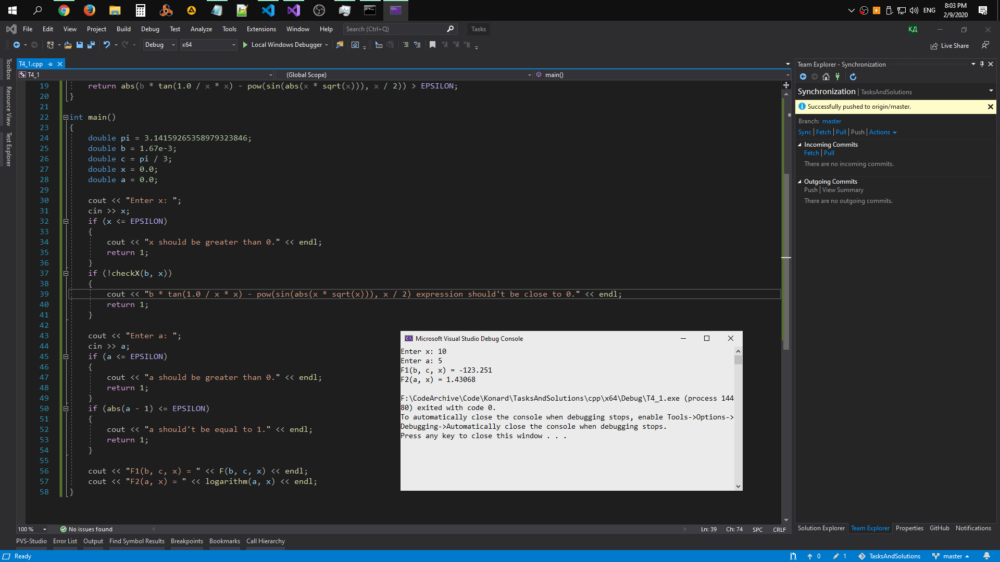

# Task 4

## Description


Составить программу для вычисления указанных математических функций, предусмотрев
случаи разрыва функций: определить ОДЗ и запрограммировать вывод результата, если он
может быть получен, в противном случае — запрограммировать сообщение, почему
вычисление функции невозможно. Аргумент x вводится с консоли, константы записываются
в формате с плавающей точкой, параметры (a, b, с) инициализируются в теле программы.
Аналитического упрощения функций НЕ делать.

log\[5/11\]\(x^2-c\)/sqrt(b*tg(x^(-2))-(sin|x*sqrt(x)|)^(x/2)) , b = 1,67*10^-3, c = π/3, x - любое число, задаётся в log\[a\]\(x\) = ln(x)/ln(a)

## Solution

```C++
#include <iostream>
#include <cmath>
using namespace std;

#define EPSILON (1.0E-8)

double logarithm(double a, double x)
{
    return log(x) / log(a);
}

double F(double b, double c, double x)
{
    return logarithm(5.0 / 11.0, x * x - c) / sqrt(b * tan(1.0 / x * x) - pow(sin(abs(x * sqrt(x))), x / 2));
}

bool checkX(double b, double x)
{
    return abs(b * tan(1.0 / x * x) - pow(sin(abs(x * sqrt(x))), x / 2)) > EPSILON;
}

int main()
{
    double pi = 3.14159265358979323846;
    double b = 1.67e-3;
    double c = pi / 3;
    double x = 0.0;
    double a = 0.0;

    cout << "Enter x: ";
    cin >> x;
    if (x <= EPSILON)
    {
        cout << "x should be greater than 0." << endl;
        return 1;
    }
    if (!checkX(b, x))
    {
        cout << "b * tan(1.0 / x * x) - pow(sin(abs(x * sqrt(x))), x / 2) expression should't be close to 0." << endl;
        return 1;
    }

    cout << "Enter a: ";
    cin >> a;
    if (a <= EPSILON)
    {
        cout << "a should be greater than 0." << endl;
        return 1;
    }
    if (abs(a - 1) <= EPSILON)
    {
        cout << "a should't be equal to 1." << endl;
        return 1;
    }

    cout << "F1(b, c, x) = " << F(b, c, x) << endl;
    cout << "F2(a, x) = " << logarithm(a, x) << endl;
}
```

[Compile and run solution #1 on Repl.it](https://repl.it/@Konard/Task41)

## Screenshot

