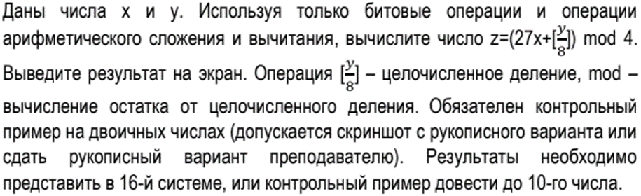
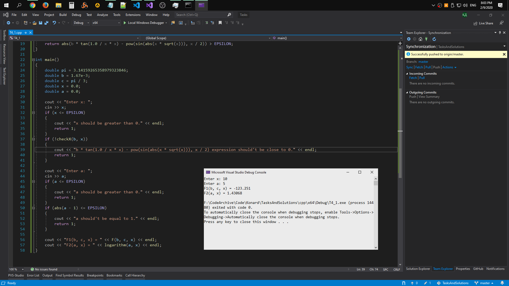

# Task 4

## Description



Даны числа х и у. Используя только битовые операции и операции арифметического сложения и вычитания, вычислите число z=(27х+\[y/8\]) mod 4. Выведите результат на экран. Операция [y/8] — целочисленное деление, mod — вычисление остатка от целочисленного деления. Обязателен контрольный пример на двоичных числах (допускается скриншот с рукописного варианта или сдать рукописный вариант преподавателю). Результаты необходимо представить в 16-й системе, или контрольный пример довести до 10-го числа.

## Solution

```C++
#include <iostream>
using namespace std;

int main()
{
	setlocal(LC_ALL, “rus”);
	int x, y, z;
	cout << "Введите х " << endl;
	cin >> x;
	cout << "Введите у : " << endl;
	cin >> y;
	z = (27 * x + (y >> 3)) >> 2;
	cout << "Z = " << z << endl << endl;
	return 0;
}
```

[Compile and run solution #1 on Repl.it](https://repl.it/@Konard/Task41)

## Screenshot

